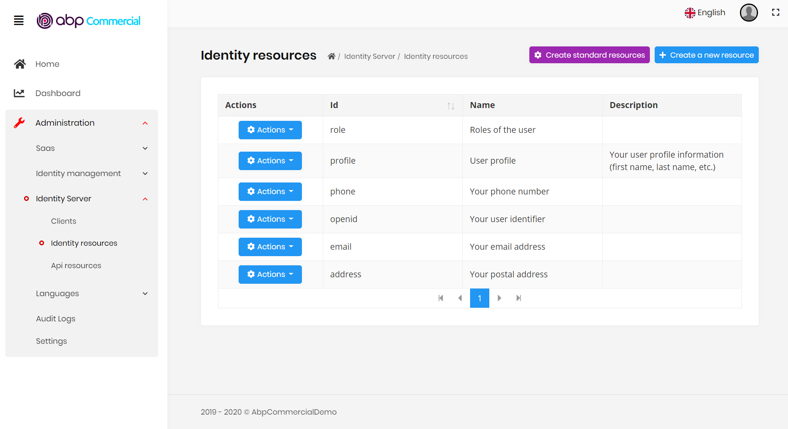
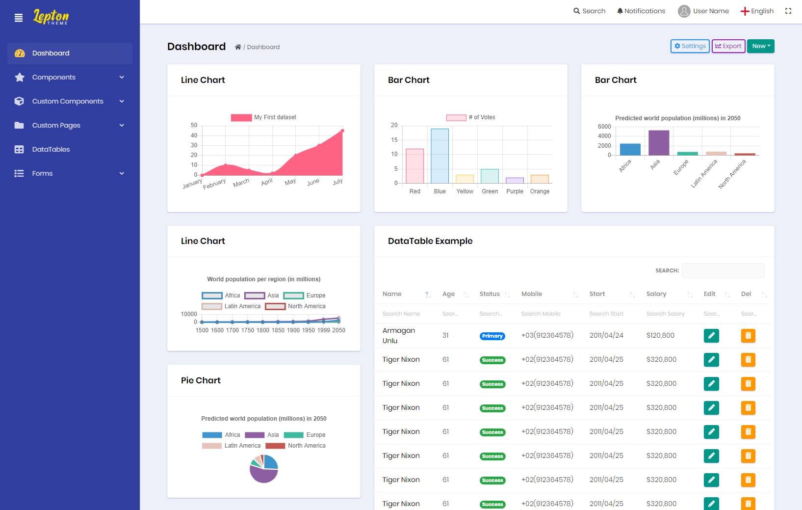
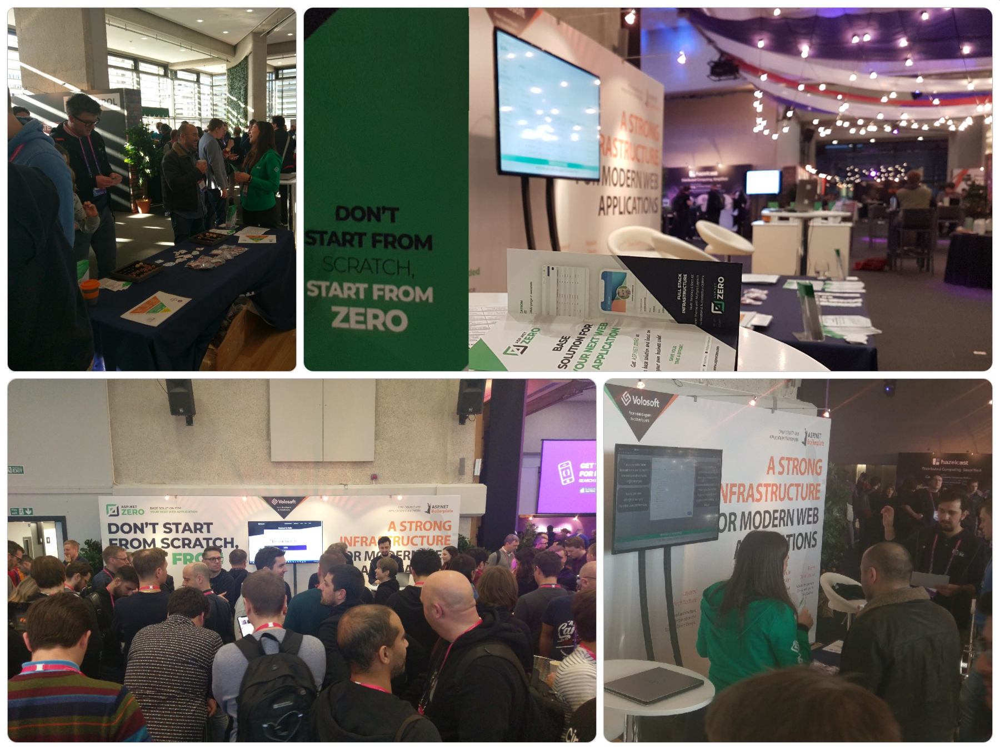
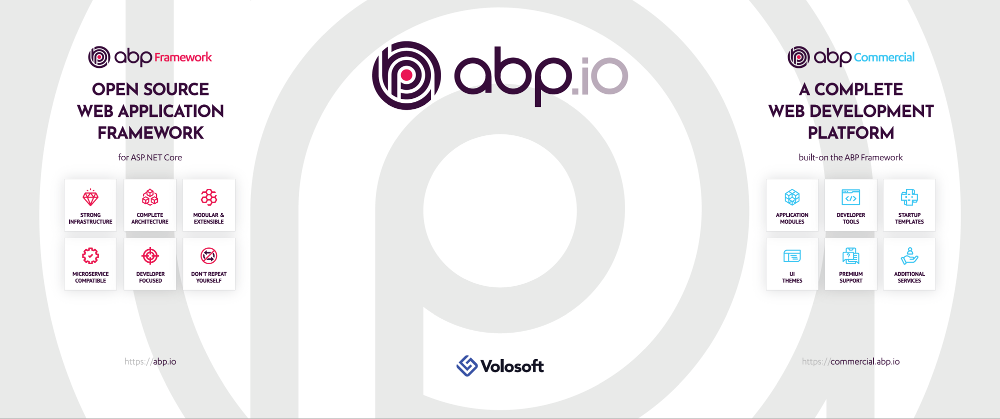

# JELLOG Framework v2.0 and the JELLOG Commercial

JELLOG Framework v2.0 has been released in this week. This post explains why we have released an **early major version** and what is changed with version 2.0.

In addition to the v2.0 release, we are excited to announce the **JELLOG Commercial**, which is a set of professional modules, tools, themes, and services built on top of the open-source JELLOG framework.

## JELLOG Framework v2.0

### Why 2.0 instead of 1.2?

It was planned to release v1.2 after the [v1.1.2](https://github.com/jellogframework/jellog/releases/tag/1.1.2) release. However, [it is reported](https://github.com/jellogframework/jellog/issues/2026) that v1.x has some **performance** and **stability** issues on Linux, especially when you deploy your application to **Linux** containers with **low CPU and memory** resources.

We have investigated the problem deeply and have seen that the root cause of the problem was related to the implementation of **intercepting `async` methods**. Besides, there were some **`async` over `sync`** usages that effected the thread pool optimization.

Finally, we **solved all the problems** with the great help of the **community**. But we also had some important **design decisions** which cause some **breaking changes** and we had to change the major version number of the framework because of the [semantic versioning](https://semver.org/).

Most of the applications won't be affected by [the breaking changes](https://github.com/jellogframework/jellog/releases), or it will be trivial to make these necessary changes.

### Breaking Changes

#### Removed Some Sync APIs

Some of the interceptors are required to use `async` APIs. When they intercept `sync` methods, they need to call `async` over `sync`. This eventually ends up with `async` over `sync` problem.  That's why we have [removed some sync APIs](https://github.com/jellogframework/jellog/pull/2464).

**`Async` over `sync`** pattern is a classical problem of `C#` when you need to **call an `async` method inside a `sync` method**. While there are some workarounds to this problem, they all have **disadvantages** and it is suggested to **not write** such code at all. You can find many documents related to this topic on the web.

To avoid this problem, we have removed:

- `sync` [repository](https://docs.jellog.io/en/jellog/latest/Repositories) methods (like `insert`, `update`, etc...),
- `sync` APIs of the [unit of work](https://docs.jellog.io/en/jellog/latest/Unit-Of-Work),
- `sync` APIs of the [background jobs](https://docs.jellog.io/en/jellog/latest/Background-Jobs),
- `sync` APIs of the [audit logging](https://docs.jellog.io/en/jellog/latest/Audit-Logging),
- some other rarely used `sync` APIs.

If you get any compile error, just use the `async` versions of these APIs.

#### Always Async!

Beginning from the v2.0, the JELLOG framework assumes that you are writing your application code `async` first. Otherwise, some framework functionalities may not properly work.

It is suggested to write `async` to all your [application services](https://docs.jellog.io/en/jellog/latest/Application-Services), [repository methods](https://docs.jellog.io/en/jellog/latest/Repositories), controller actions, page handlers.

Even if your application service method doesn't need to be `async` , set it as `async` , because interceptors perform `async` operations (for authorization, unit of work, etc...). You can return `Task.Completed` from a method that doesn't make an `async` call.

Example:

````csharp
public Task<int> GetValueAsync()
{
    //this method doesn't make any async call.
    return Task.CompletedTask(42);
}
````

The example above normally doesn't need to be `async` because it doesn't perform an `async` call. However, making it `async` helps the JELLOG framework to run interceptors without `async` over sync calls.

This rule doesn't force you to write every method `async` . This would not be good and would be tedious. It is only needed for the intercepted services (especially for [application services](https://docs.jellog.io/en/jellog/latest/Application-Services) and [repository methods](https://docs.jellog.io/en/jellog/latest/Repositories))

#### Other Breaking Changes

See [the release notes](https://github.com/jellogframework/jellog/releases/tag/2.0.0) for the other breaking changes. Most of them will not affect your application code.

### New Features

This release also contains some new features and tens of enhancements:

- [#2597](https://github.com/jellogframework/jellog/pull/2597) New `DataGap.Jellog.AspNetCore.Serilog` package.
- [#2526](https://github.com/jellogframework/jellog/issues/2526) Client-side validation for the dynamic `C#` client proxies.
- [#2374](https://github.com/jellogframework/jellog/issues/2374) `Async` background jobs.
- [#265](https://github.com/jellogframework/jellog/issues/265) Managing the application shutdown.
- [#2472](https://github.com/jellogframework/jellog/issues/2472) Implemented `DeviceFlowCodes` and `TokenCleanupService` for the `IdentityServer` module.

See [the release notes](https://github.com/jellogframework/jellog/releases/tag/2.0.0) for the complete list of features, enhancements and bug fixes.

### Documentation

We have completed some missing documentation with the v2.0 release. In the following weeks, we will mostly focus on the documentation and tutorials.

## JELLOG Commercial

[JELLOG Commercial](https://commercial.jellog.io/) is a set of professional **modules, tools, themes, and services** built on top of the open-source JELLOG framework.

- It provides [professional modules](https://commercial.jellog.io/modules) in addition to the JELLOG Framework's free & [open source modules](https://docs.jellog.io/en/jellog/latest/Modules/Index).
- It includes a beautiful a [UI theme](https://commercial.jellog.io/themes) with 5 different styles.
- It provides the [JELLOG Suite](https://commercial.jellog.io/tools/suite); A tool to assist your development to make you more productive. It currently can create full-stack CRUD pages in a few seconds by configuring your entity properties. More functionalities will be added over time.
- [Premium support](https://commercial.jellog.io/support) for enterprise companies.

In addition to these standard set of features, we will provide customer basis services. See the [commercial.jellog.io](https://commercial.jellog.io/) web site for other details.

### JELLOG Framework vs the JELLOG Commercial

The JELLOG Commercial **is not a paid version** of the JELLOG Framework. You can consider it as **set of additional benefits** for professional companies. You can use it to save your time and develop your product faster.

JELLOG Framework is **open source & free** and will always be like that!

As a principle, we build the main infrastructure as open-source and sell additional pre-built application features, themes, and tools. The main idea similar to the [ASP.NET Boilerplate](https://aspnetboilerplate.com/) & the [ASP.NET Zero](https://aspnetzero.com/) products. 

Buying a commercial license saves your significant time and effort and you can focus on your own business, besides you get dedicated and high priority support. Also, you will be supporting the JELLOG core team since we are spending most of our time to develop, maintain and support the open-source JELLOG Framework.

With the introduction of the JELLOG Commercial, now JELLOG becomes a platform. We call it as the **JELLOG.IO Platform** which consists of the open source JELLOG Framework and the JELLOG Commercial.

### Demo

If you are wondering how exactly looks like the JELLOG Commercial application startup template, you can easily [create a demo](https://commercial.jellog.io/demo) and see it in action. The demo includes all the pre-built modules and the theme.

Here, a screenshot from the IdentityServer management module UI:



This is another screenshot from a demo application using the material design style of the theme:



### Pricing

You can build **unlimited projects/products**, sell to **unlimited customers**, host **unlimited servers** without any restriction. Pricing is mostly based on the **developer count**, **support level** and **source code** requirement. There are three main packages;

- **Team license**: Includes all the modules, themes and tools. Allows developing your product with up to 3 developers. You can buy additional developer licenses.
- **Business license**: Allows downloading the source code of all the modules and the themes. Also, it includes 5 developer licenses by default. You can buy additional developer licenses.
- **Enterprise license**: Provides unlimited and private support in addition to the benefits of the business license.

See the [pricing page](https://commercial.jellog.io/pricing) for details. In addition to the standard packages, we are also providing custom services and custom licensing. [Contact us](https://commercial.jellog.io/contact) if you have any questions.

#### License Comparison

The license price changes based on your developer count, support level and source-code access.

##### The Source-Code

Team license doesn't include the source-code of the pre-built modules & themes. It uses all these modules as **NuGet & NPM packages**. In this way, you can easily **get new features and bug fixes** by just updating the package dependencies. But you can't access their source-code. So you don't have the possibility to embed a module's source code into your application and freely change the source-code.

Pre-built modules provide some level of **customization** and **extensibility** and allow you to override services, UI parts and so on. We are working on to make them much more customizable and extensible. If you don't need to make major changes in the pre-built modules, the team license will be ideal for you, because it is cheaper and allows you to easily get new features and bug fixes.

Business and Enterprise licenses allow you to **download the source-code** of any module or the theme when you need it. They also use the same startup template with the team license, so all modules are used as `NuGet` & `NPM` packages by default. But in case of need, you can remove the package dependencies for a module and embed its source-code into your own solution to completely customize it. In this case, upgrading the module will not be as easy as before when a new version is available. You don't have to upgrade it, surely! But if you want, you should do it yourself using some merge tool or Git branch system.

#### License Lifetime

JELLOG Commercial license is **perpetual**, which means you can **use it forever** and continue to develop your applications.

However, the following services are covered for one year:

- Premium **support** ends after one year. You can continue to get community support.
- You can not get **updates** of the modules & the themes after one year. You can continue to use the last obtained version. You can even get bug fixes and enhancements for your current major version.
- You can use the **JELLOG Suite** tool for one year.

If you want to continue to get these benefits, you can extend your license period. Renewing price is 20% less than the regular price.

## NDC London 2020

Just like the [previous year](https://medium.com/dataGapsoft/impressions-of-ndc-london-2019-f8f391bb7a9c), we are a partner of the famous software development conference: [NDC London](https://ndc-london.com/)! In the previous year, we were there with the [ASP.NET Boilerplate](https://aspnetboilerplate.com/) & [ASP.NET Zero](https://aspnetzero.com/) theme:



This year, we will be focusing on the **JELLOG.IO Platform** (The Open Source JELLOG Framework and the JELLOG Commercial). Our booth wall will be like that:



If you attend to the conference, remember to visit our booth. We would be glad to talk about the JELLOG platform features, goals and software development in general.

### Would you like to meet the JELLOG Team?

If you are in London and want to have a coffee with us, we will be available at February 1st afternoon. [@hibrahimkalkan](https://twitter.com/hibrahimkalkan) and [@ismcagdas](https://twitter.com/ismcagdas) will be there.

Just write to info@jellog.io if you want to meet :)