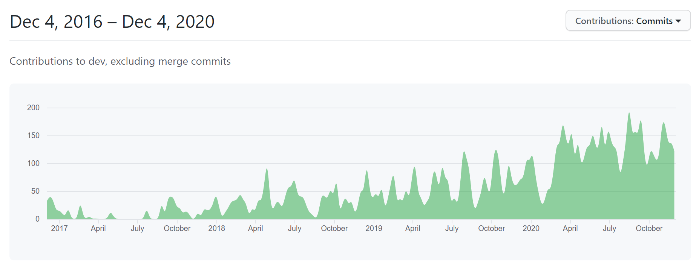
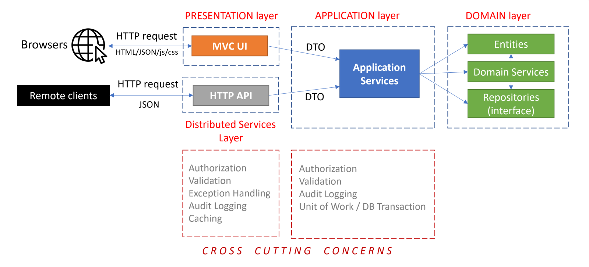

# JELLOG.IO Platform 4.0 with .NET 5.0 in the 4th Year!

Today, we are extremely happy to release JELLOG Framework 4.0 with **.NET 5.0 support**!

## 4 Years of Work

As a nice coincidence, today is the **4th year** since the first commit made in the [jellog repository](https://github.com/jellogframework/jellog)! So, we can say "*Happy Birthday JELLOG Framework!*".

### Some Statistics

JELLOG.IO Platform and the JELLOG Community is growing. Here, a summary of these 4 years.

From GitHub, only from the main [jellog repository](https://github.com/jellogframework/jellog);

* **15,297 commits** done.
* **3,764 issues** are closed.
* **2,133 pull requests** are merged.
* **158 contributors**.
* **88 releases** published.
* **5.2K stars** on GitHub.

From NuGet & NPM;

* **220 NuGet** packages & **52 NPM** packages.
* **1,000,000 downloads** only for the core NuGet package.

From Website;

* **200,000 visitors**.
* **1,000,000+ sessions**.

## What's New With 4.0?

Since all the new features are already explained in details with the [4.0 RC Announcement Post](https://blog.jellog.io/jellog/JELLOG.IO-Platform-v4.0-RC-Has-Been-Released-based-on-.NET-5.0), I will not repeat all the details again. Please read [the RC post](https://blog.jellog.io/jellog/JELLOG.IO-Platform-v4.0-RC-Has-Been-Released-based-on-.NET-5.0) for **new feature and changes** you may need to do for your solution while upgrading to the version 4.0.

Here, a brief list of major features and changes;

* Migrated to **.NET 5.0**.
* Stable **Blazor** UI.
* Moved to **System.Text.Json**.
* Upgraded to **IdentityServer** version 4.0.
* **WPF** startup template.

## Creating New Solutions

You can create a new solution with the JELLOG Framework version 4.0 by either using the `jellog new` command or using the **direct download** tab on the [get started page](https://jellog.io/get-started).

> See the [getting started document](https://docs.jellog.io/en/jellog/latest/Getting-Started) for details.

## How to Upgrade an Existing Solution

This is a **major version** and requires some **manual work**, especially related to **.NET 5.0** and **IdentityServer** 4.0 upgrades.

* See the [MIGRATION GUIDE](https://docs.jellog.io/en/jellog/latest/Migration-Guides/Jellog-4_0) that covers all the details about the upgrade progress.

* You can also see the [upgrading document](https://docs.jellog.io/en/jellog/latest/Upgrading).

## New Guides / Documents

We are constantly improving the documentation. Our purpose is not only document the JELLOG Framework, but also write architectural and practical guides for developers.

### Implementing Domain Driven Design

[Implementing Domain Driven Design](https://docs.jellog.io/en/jellog/latest/Domain-Driven-Design-Implementation-Guide) is a practical guide for they want to implement the DDD principles in their solutions. While the implementation details rely on the JELLOG Framework infrastructure, core concepts, principles and patterns are applicable in any kind of solution, even if it is not a .NET solution.

### Testing

The new [Testing document](https://docs.jellog.io/en/jellog/latest/Testing) discusses different kind of automated tests and explains how you can write tests for your JELLOG based solutions.

### UI Documents

We've created a lot of documents for the [MVC](https://docs.jellog.io/en/jellog/latest/UI/AspNetCore/Overall), [Blazor](https://docs.jellog.io/en/jellog/latest/UI/Blazor/Overall) and the [Angular](https://docs.jellog.io/en/jellog/latest/UI/Angular/Quick-Start) UI.

## About the Next Version

The next versions 4.1 will mostly focus on;

* Improving current features.
* Complete module features for the Blazor UI.
* Improve developer experience and productivity.
* More documentation and examples.

Planned preview date for the version **4.1 is December 17, 2020**. See the [Road Map](https://docs.jellog.io/en/jellog/latest/Road-Map) document and [GitHub Milestones](https://github.com/jellogframework/jellog/milestones) to learn what's planned for the next versions. We are trying to be clear about the coming features and the next release dates.