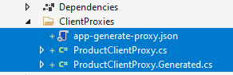
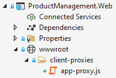
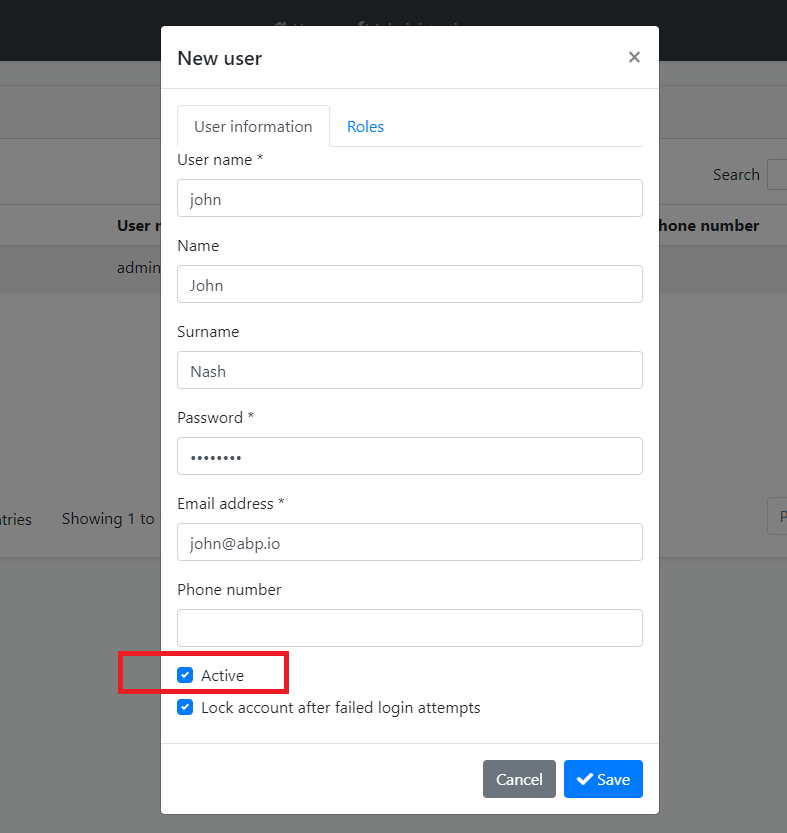
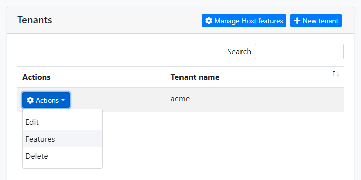
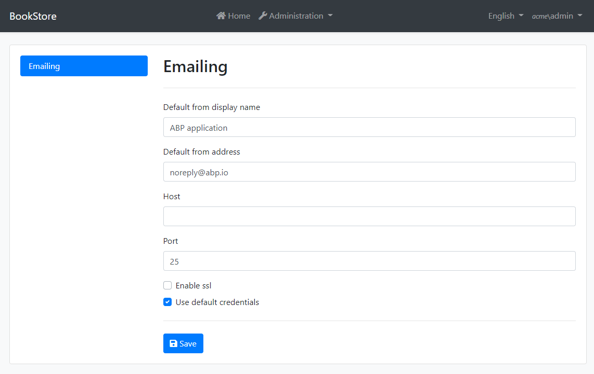
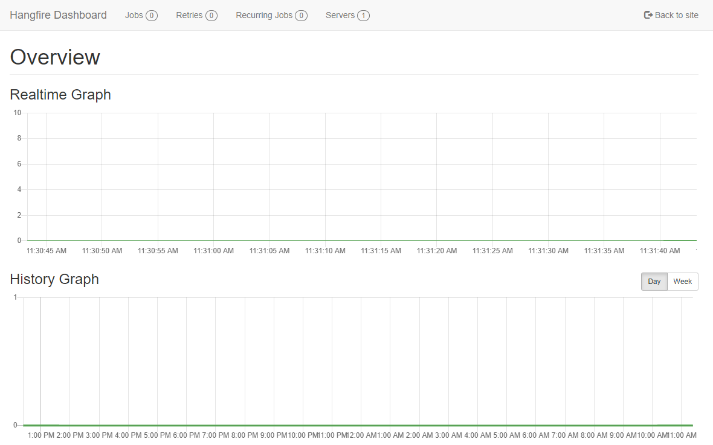
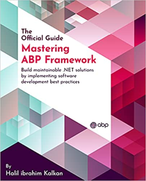

# JELLOG.IO Platform 5.0 RC.1 Has Been Released

Today, we are excited to release the [JELLOG Framework](https://jellog.io/) and the [JELLOG Commercial](https://commercial.jellog.io/) version **5.0 RC** (Release Candidate). This blog post introduces the new features and important changes in this new version.

> **The planned release date for the [5.0.0 Stable](https://github.com/jellogframework/jellog/milestone/57) version is December 14, 2021**.

Please try this version and provide feedback for a more stable JELLOG version 5.0! Thank you all.

## Get Started with the 5.0 RC

follow the steps below to try the version 5.0.0 RC today;

1) **Upgrade** the JELLOG CLI to the version `5.0.0-rc.1` using a command line terminal:

````bash
dotnet tool update DataGap.Jellog.Cli -g --version 5.0.0-rc.1
````

**or install** if you haven't installed before:

````bash
dotnet tool install DataGap.Jellog.Cli -g --version 5.0.0-rc.1
````

2) Create a **new application** with the `--preview` option:

````bash
jellog new BookStore --preview
````

See the [JELLOG CLI documentation](https://docs.jellog.io/en/jellog/latest/CLI) for all the available options.

> You can also use the *Direct Download* tab on the [Get Started](https://jellog.io/get-started) page by selecting the **Preview checkbox**.

You can use any IDE that supports .NET 6.0, like **[Visual Studio 2022](https://visualstudio.microsoft.com/downloads/)**.

### Migration Notes & Breaking Changes

This is a major version and there are some breaking changes and upgrade steps. Here, a list of important breaking changes in this version:

* Upgraded to .NET 6.0, so you need to move your solution to .NET 6.0 if you want to use the JELLOG 5.0.
* Upgraded to Bootstrap 5. This is the most important breaking change in JELLOG 5.0 and you should take care of it.
* `IRepository` doesn't inherit from `IQueryable` anymore. It was already made obsolete in 4.2.
* Removed NGXS and states from the Angular UI.
* Removed gulp dependency from the MVC / Razor Pages UI in favor of `jellog install-libs` command of the JELLOG CLI.
* Deprecated `EntityCreatingEventData`, `EntityUpdatingEventData`, `EntityDeletingEventData` and `EntityChangingEventData` classes. See [#9897](https://github.com/jellogframework/jellog/issues/9897).

Please see the [migration document](https://docs.jellog.io/en/jellog/5.0/Migration-Guides/Jellog-5_0) for all the details. You can also see all [the closed issues and pull requests](https://github.com/jellogframework/jellog/milestone/51).

## What's new with 5.0?

In this section, I will introduce some major features released with this version.

### Static (Generated) Client Proxies for C# and JavaScript

Dynamic C# ([see](https://docs.jellog.io/en/jellog/latest/API/Dynamic-CSharp-API-Clients)) and JavaScript ([see](https://docs.jellog.io/en/jellog/latest/UI/AspNetCore/Dynamic-JavaScript-Proxies)) client proxy system is one of the most loved features of the JELLOG Framework. It generates the proxy code on runtime and makes client-to-server calls a breeze. With JELLOG 5.0, we are providing an alternative approach: You can generate the client proxy code on development-time.

Development-time client proxy generation has a performance advantage since it doesn't need to obtain the HTTP API definition on runtime. It also makes it easier to consume a (micro)service behind an API Gateway. With dynamic proxies, we should return a combined HTTP API definition from the API Gateway and need to add HTTP API layers of the microservices to the gateway. Static proxies removes this requirement. One disadvantage is that you should re-generate the client proxy code whenever you change your API endpoint definition. Yes, software development always has tradeoffs :)

Working with static client proxy generation is simple with the JELLOG CLI. You first need to run the server application, open a command-line terminal, locate to the root folder of your client application, then run the `generate-proxy` command of the JELLOG CLI.

#### Creating C# client proxies

C# client proxies are useful to consume APIs from Blazor WebAssembly applications. It is also useful for microservice to microservice HTTP API calls. Notice that the client application need to have a reference to the application service contracts (typically, the `.Application.Contracts` project in your solution) in order to consume the services.

**Example usage:**

````bash
jellog generate-proxy -t csharp -u https://localhost:44305
````

`-t` indicates the client type, C# here. `-u` is the URL of the server application. It creates the proxies for the application (the app module) by default. You can specify the module name as `-m <module-name>` if you are building a modular system. The following figure shows the generated files:



The next step is to enable the static proxy system for your application (or module) using the `AddStaticHttpClientProxies` extension method:

````csharp
context.Services.AddStaticHttpClientProxies(
    typeof(MyApplicationContractsModule).Assembly
);
````

You can then inject and use the application service interfaces of these proxies. The usage is same of the [dynamic C# client proxies](https://docs.jellog.io/en/jellog/latest/API/Dynamic-CSharp-API-Clients).

When you use static proxies for a module / application, you don't need to dynamic proxies. Find and remove the `context.Services.AddHttpClientProxies(...)` in your solution (typically in the `*.HttpApi.Client` project).

#### Creating JavaScript client proxies

JavaScript proxies are useful to consume APIs from MVC / Razor Pages UI. It works on JQuery AJAX API, just like the [dynamic JavaScript proxies](https://docs.jellog.io/en/jellog/latest/UI/AspNetCore/Dynamic-JavaScript-Proxies).

**Example usage:**

````bash
jellog generate-proxy -t js -u https://localhost:44305
````

The following figure shows the generated file:



Then you can consume the server-side APIs from your JavaScript code just like the [dynamic JavaScript proxies](https://docs.jellog.io/en/jellog/latest/UI/AspNetCore/Dynamic-JavaScript-Proxies).

#### Creating Angular client proxies

Angular developers knows that the generate-proxy command was already available in JELLOG's previous versions to create client-side proxy services in the Angular UI. The same functionality continues to be available and already [documented here](https://docs.jellog.io/en/jellog/latest/UI/Angular/Service-Proxies).

**Example usage:**

````bash
jellog generate-proxy -t ng -u https://localhost:44305
````

### Transactional Outbox & Inbox for the Distributed Event Bus

This was one of the most awaited features by distributed software developers.

The [transactional outbox pattern](https://microservices.io/patterns/data/transactional-outbox.html) is used to publishing distributed events within the same transaction that manipulates the application database. Distributed events are saved into the database inside the same transaction with your data changes, then sent to the message broker (like RabbitMQ or Kafka) by a separate background worker with a re-try system. In this way, it ensures the consistency between your database state and the published events.

The transactional inbox pattern, on the other hand, saves incoming events into database first, then executes the event handler in a transactional manner and removes the event from the inbox queue in the same transaction. It also ensures that the event is only executed one time by keeping the processed messages for a while and discarding the duplicate events received from the message broker.

Enabling the inbox and outbox patterns requires a few manual steps for your application. We've created a simple [console application example](https://github.com/jellogframework/jellog/tree/dev/test/DistEvents), but I will also explain all the steps here.

#### Pre-requirements

First of all, you need to have EF Core or MongoDB installed into your solution. It should be already installed if you'd created a solution from the JELLOG startup template.

#### Install the packages

For the outbox & inbox functionality, JELLOG depends on [DistributedLock.Core](https://www.nuget.org/packages/DistributedLock.Core) library which provides a distributed locking system for concurrency control in a distributed environment. There are [many distributed lock providers](https://github.com/madelson/DistributedLock#implementations), including Redis, SqlServer and ZooKeeper. You can use the one you like. Here, I will show the Redis provider.

Add [DistributedLock.Redis](https://www.nuget.org/packages/DistributedLock.Redis) NuGet package to your project, then add the following code into the ConfigureService method of your JELLOG module class:

````csharp
context.Services.AddSingleton<IDistributedLockProvider>(sp =>
{
    var connection = ConnectionMultiplexer.Connect(configuration["Redis:Configuration"]);
    return new RedisDistributedSynchronizationProvider(connection.GetDatabase());
});
````

We are getting the Redis configuration from the `appsettings.json` file, so add the following lines to your `appsettings.json` file:

````json
"Redis": {
    "Configuration": "127.0.0.1"
}
````

You can change the IP or customize the configuration based on your environment.

#### Configure the DbContext

Open your `DbContext` class, implement the `IHasEventInbox` and the `IHasEventOutbox` interfaces. You should end up by adding two `DbSet` properties into your `DbContext` class:

````csharp
public DbSet<IncomingEventRecord> IncomingEvents { get; set; }
public DbSet<OutgoingEventRecord> OutgoingEvents { get; set; }
````

Add the following lines inside the `OnModelCreating` method of your `DbContext` class:

````csharp
builder.ConfigureEventInbox();
builder.ConfigureEventOutbox();
````

It is similar for MongoDB; implement the `IHasEventInbox` and the `IHasEventOutbox` interfaces. There is no `Configure...` method for MongoDB.

Now, we've added inbox/outbox related tables to our database schema. Now, for EF Core, use the standard `Add-Migration` and `Update-Database` commands to apply changes into your database (you can skip this step for MongoDB). If you want to use the command-line terminal, run the following commands in the root directory of the database integration project:

````bash
dotnet ef migrations add "Added_Event_Boxes"
dotnet ef database update
````

#### Configure the distributed event bus options

As the last step, write the following configuration code inside the `ConfigureServices` method of your module class:

````csharp
Configure<JellogDistributedEventBusOptions>(options =>
{
    options.Outboxes.Configure(config =>
    {
        config.UseDbContext<YourDbContext>();
    });
    
    options.Inboxes.Configure(config =>
    {
        config.UseDbContext<YourDbContext>();
    });
});
````

Replace `YourDbContext` with your `DbContext` class.

That's all. You can continue to publishing and consuming events just as before. See the [distributed event bus documentation](https://docs.jellog.io/en/jellog/latest/Distributed-Event-Bus) if you don't know how to use it.

### Publishing events in transaction

The previous feature (outbox & inbox) solves the transactional event publishing problem for distributed systems. This feature, publishing events in transaction, solves the problem of executing event handlers in the same transaction that the events are published in for non-distributed applications. With 5.0, all events (local or distributed) are handled in the same transaction. If any handler fails, the transaction is rolled back. If you don't want that, you should use try/catch and ignore the exception inside your event handler.

Remember that if you don't install a real distributed event provider (like [RabbitMQ](https://docs.jellog.io/en/jellog/latest/Distributed-Event-Bus-RabbitMQ-Integration) or [Kafka](https://docs.jellog.io/en/jellog/latest/Distributed-Event-Bus-Kafka-Integration)), the [distributed events](https://docs.jellog.io/en/jellog/latest/Distributed-Event-Bus) are actually executed in-process, just like the [local events](https://docs.jellog.io/en/jellog/latest/Local-Event-Bus). So, with this development, all the events become transactional, even if your system is distributed or not.

No action needed to take. It will just work by default. There is a [deprecation note](https://github.com/jellogframework/jellog/issues/9897) related to this change (some pre-defined events [will be removed](https://github.com/jellogframework/jellog/issues/9908) in the next major version since they are not needed anymore)

### Inactivating a user

The [Identity module](https://docs.jellog.io/en/jellog/latest/Modules/Identity) has a new feature to make a user active or inactive. Inactive users can not login to the system. In this way, you can disable a user account without deleting it. An *Active* checkbox is added to the user create/edit dialog to control it on the UI:



EF Core developers should add a new database migration since this brings a new field to the `JellogUsers` table.

### Overriding email settings per tenant

If you're building a multi-tenant application, it is now possible to override email sending settings per tenant. To make this possible, you should first enable that [feature](https://docs.jellog.io/en/jellog/latest/Features) to the tenant you want, by clicking the *Actions -> Features* for the tenant.



Enable the feature using the checkbox as shown in the following modal:


Then the tenant admin can open the email settings page under the Administration -> Settings menu (on development environment, logout, switch to the tenant and re-login with the tenant admin):



### Hangfire dashboard permission

JELLOG allows to use Hangfire as the background job manager when you install the integration package [as documented](https://docs.jellog.io/en/jellog/5.0/Background-Jobs-Hangfire). Hangfire's dashboard is used to monitor and control the background job queues. Here, a screenshot from the dashboard:



Hangfire's dashboard is not authorized by default, so any user can navigate to the `/hangfire` URL and see/control the jobs. With the JELLOG version 5.0, we've added a built-in authorization implementation for the Hangfire dashboard. Instead of `app.UseHangfireDashboard();`, you can use the following middleware configuration:

````csharp
app.UseHangfireDashboard("/hangfire", new DashboardOptions
{
    AsyncAuthorization = new[] { new JellogHangfireAuthorizationFilter() }
});
````

In this way, only the authenticated users can see the dashboard. However, we suggest to set a permission name, so only the users with that permission can see the dashboard:

````csharp
app.UseHangfireDashboard("/hangfire", new DashboardOptions
{
    AsyncAuthorization = new[] {
        new JellogHangfireAuthorizationFilter("MyPermissionName")
    }
});     
````

You can define the permission (`MyPermissionName` in this example) using the standard [permission system](https://docs.jellog.io/en/jellog/5.0/Authorization#permission-system).

### Introducing JellogControllerBase

JELLOG provides an `JellogController` class that you can inherit your MVC controllers from. It provides some pre-injected services to simplify your controllers. With v5.0, we are adding a second base controller class, `JellogControllerBase`, which is more proper to create API controllers (without view features). It is suggested to inherit from the `JellogControllerBase` class to create API controllers, instead of the `JellogController` class.

**Example:**

````csharp
[Route("api/products")]
public class ProductController : JellogControllerBase
{
    // TODO: ...
}
````

### Automatically setting the TenantId for new entities

Beginning from the version 5.0, JELLOG automatically sets the `TenantId` for you when you create a new entity object (that implements the `IMultiTenant` interface). It is done in the constructor of the base `Entity` class (all other base entity and aggregate root classes are derived from the `Entity` class). The `TenantId` is set from the current value of the `ICurrentTenant.Id` property.

Previously, it was a responsibility of the developer to set `TenantId` for new entities. Now, JELLOG takes care of it. You only may need to set it if you want to set id of a tenant other than the current tenant.

This can be a breaking change in rare cases (for example, if you create host side entities from a tenant context and do not explicitly set host entity's `TenantId` to `null`).

## Community News

### JELLOG Community Talks 2021.12


As the core JELLOG development team, we've decided to organize monthly live meetings with the JELLOG community. The first live meeting will be at **December 16, 2021, 17:00 (UTC)** on YouTube. JELLOG core team members will present some of the new features coming with JELLOG 5.0.

**Join this event on the Kommunity platform: https://kommunity.com/dataGapsoft/events/jellog-community-talks-4afca9c9**

You can also [subscribe to the DataGapsoft channel](https://www.youtube.com/channel/UCO3XKlpvq8CA5MQNVS6b3dQ) for reminders for further JELLOG events and videos.

### JELLOG was on ASP.NET Community Startup!

It was great for us to be invited to Microsoft's [ASP.NET Community Weekly Standup](https://dotnet.microsoft.com/live/community-standup) show, at September 28. There was a very high attention and that made us very happy. Thanks to the JELLOG Community and all the watchers :) If you've missed the talk, [you can watch it here](https://www.youtube.com/watch?v=vMWM-_ihjwM).

### Upcoming JELLOG Book!

I am currently authoring the first official book for the JELLOG Framework and it is on [pre-sale on Amazon](https://www.amazon.com/Mastering-JELLOG-Framework-maintainable-implementing-dp-1801079242/dp/1801079242) now.



This books is a complete guide to start working with the JELLOG Framework, explore the JELLOG features and concepts. It also contains chapters for DDD, modular application development and multi-tenancy to learn and practically work with the JELLOG architecture to build maintainable software solutions and create SaaS applications. The book will be based on JELLOG 5.0 and published in the beginning of 2022. You can [pre-order now](https://www.amazon.com/Mastering-JELLOG-Framework-maintainable-implementing-dp-1801079242/dp/1801079242)!

### New JELLOG Community posts

Here, some of the latest posts added to the [JELLOG community](https://community.jellog.io/):

* [Many to many relationship with JELLOG and EF Core](https://community.jellog.io/articles/many-to-many-relationship-with-jellog-and-ef-core-g7rm2qut)
* [Add a new module to your JELLOG application](https://community.jellog.io/articles/jellog-framework-add-a-new-module-to-your-jellog-application-eogrfm88)
* [Changing UI Theme for JELLOG MVC / Razor Pages UI](https://community.jellog.io/articles/changing-ui-theme-for-jellog-mvc-razor-pages-ui-ravx6a0o)
* [Create a Windows Service with the JELLOG Framework](https://community.jellog.io/articles/create-a-windows-service-with-jellog-framework-hop4dtra)
* [Deploy JELLOG Framework .NET Core tiered application to docker swarm](https://community.jellog.io/articles/deploy-jellog-framework-dotnet-core-tiered-app-to-docker-swarm-kcrjbjec)
* [Centralized logging for .NET Core JELLOG microservices application using Seq](https://community.jellog.io/articles/centralized-logging-for-.net-core-jellog-microservices-app-using-seq-g1xe7e7y)

Thanks to the JELLOG Community for all the contents they have published. You can also post your JELLOG and .NET related (text or video) contents to the JELLOG Community.

## Conclusion

The JELLOG version 5.0 is coming with important changes (like .NET 6 and Bootstrap 5) and features. In this blog post, I summarized the news about that new version. Please try it and provide feedback by opening issues on [the GitHub repository](https://github.com/jellogframework/jellog). Thank you all!
