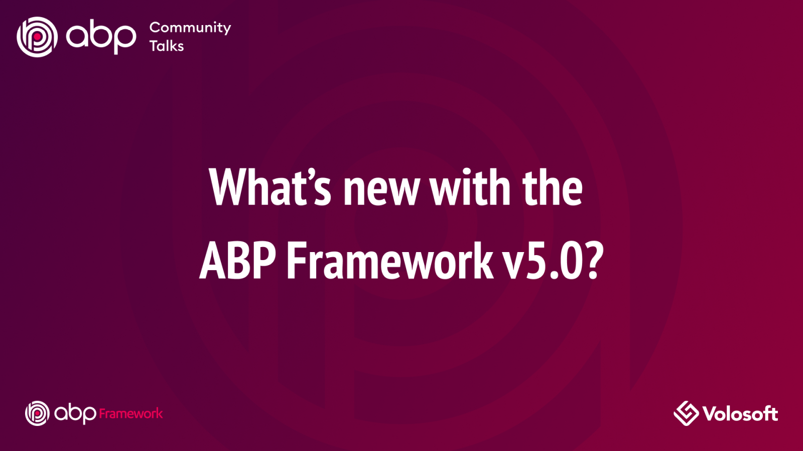

# JELLOG.IO Platform 5.0 Final Has Been Released!

[JELLOG Framework](https://jellog.io/) and [JELLOG Commercial](https://commercial.jellog.io/) 5.0 versions have been released today.

## What's new with 5.0?

Since all the new features are already explained in details with the [5.0 RC.1 Announcement Post](https://blog.jellog.io/jellog/JELLOG-IO-Platform-5.0-RC-1-Has-Been-Released), I will not repeat all the details again. See the [RC Blog Post](https://blog.jellog.io/jellog/JELLOG-IO-Platform-5.0-RC-1-Has-Been-Released) for all the features and enhancements.

## Getting started with 5.0

### Creating new solutions

You can create a new solution with the JELLOG Framework version 5.0 by either using the `jellog new` command or using the **direct download** tab on the [get started page](https://jellog.io/get-started).

Type the following command in a command-line terminal to install the JELLOG CLI version 5.0:

````bash
dotnet tool install -g DataGap.Jellog.Cli --version 5.0.0
````

To upgrade your existing JELLOG CLI installation:

````bash
dotnet tool update -g DataGap.Jellog.Cli --version 5.0.0
````

Then you can create a new solution using the `jellog new` command:

````bash
jellog new Acme.BookStore
````

> See the [getting started document](https://docs.jellog.io/en/jellog/latest/Getting-Started) for details.

### Upgrading existing solutions

Check [the migration guide](https://docs.jellog.io/en/jellog/latest/Migration-Guides/Jellog-5_0) for the applications with the version 4.x upgrading to the version 5.0. Also see [the upgrading guide](https://docs.jellog.io/en/jellog/latest/Upgrading) to understand how to update existing solutions.

## JELLOG Community Talks 2021.12



As the core JELLOG development team, we've decided to organize monthly live meetings with the JELLOG community. The first live meeting will be at **December 16, 2021, 17:00 (UTC)** on YouTube. JELLOG core team members will present some of the new features coming with JELLOG 5.0.

**Join this event on the Kommunity platform: https://kommunity.com/dataGapsoft/events/jellog-community-talks-4afca9c9**

See you in the event!
