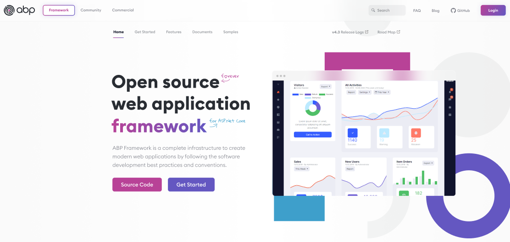
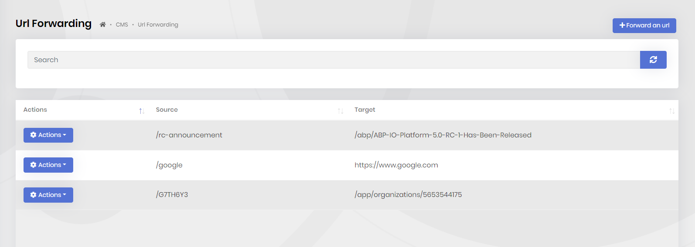
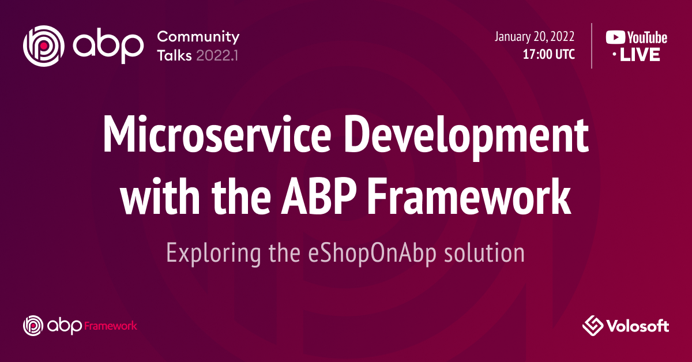

# JELLOG.IO Platform 5.1 Has Been Released

Today, we are releasing the [JELLOG Framework](https://jellog.io/) and [JELLOG Commercial](https://commercial.jellog.io/) version 5.1 (with a version number `5.1.1`). This blog post introduces the new features and important changes in this new version.

> **Warning**
>
> For a long time we've been releasing RC (Release Candidate) versions a few weeks prior to every minor and major release. **This version has been released without a preview version.** This is because we've accidently released all the packages with a stable version number, without a `-rc.1` suffix and there is no clear way to unpublish all the NuGet and NPM packages. We're sorry about that. However, it doesn't mean that this release is buggy. We've already resolved the known problems. We will publish one or more patch releases if needed. You can follow [this milestone](https://github.com/jellogframework/jellog/milestone/64?closed=1) for the common problems or submit your own bug report. If you are worried about its stability, you can wait for the next patch release.

## Get Started with 5.1

Follow the steps below to try the 5.1 version today:

1) **Upgrade** the JELLOG CLI to the latest version using a command line terminal:

````bash
dotnet tool update DataGap.Jellog.Cli -g
````

**or install** if you haven't installed it before:

````bash
dotnet tool install DataGap.Jellog.Cli -g
````

2) Create a **new application**:

````bash
jellog new BookStore
````

Check out the [JELLOG CLI documentation](https://docs.jellog.io/en/jellog/latest/CLI) for all the available options.

> You can also use the *Direct Download* tab on the [Get Started](https://jellog.io/get-started) page.

You can use any IDE that supports .NET 6.x development (e.g. [Visual Studio 2022](https://visualstudio.microsoft.com/downloads/)).

### Migration Notes & Breaking Changes

This is a minor feature release, mostly with enhancements and improvements based on [version 5.0](https://blog.jellog.io/jellog/JELLOG-IO-Platform-5-0-Final-Has-Been-Released). There aren't any breaking changes except for the Angular UI upgrade. JELLOG 5.1 startup templates use **Angular 13**.

### Angular UI

**If you want to upgrade the JELLOG Framework but want to continue with Angular 12**, add the following section to the `package.json` file of the Angular project:

````json
"resolutions": {
    "ng-zorro-antd": "^12.1.1",
    "@ng-bootstrap/ng-bootstrap": "11.0.0-beta.2"
  }
````

### Blazor UI

If you are using Blazor WebAssembly, open the `Program` class and replace `InitializeAsync` with `InitializeApplicationAsync`.

## What's New with the JELLOG Framework 5.1?

In this section, I will introduce some major features released with this version.

### The New Hosting Model

The JELLOG startup application template now uses the new ASP.NET Core hosting APIs ([check out the Microsoft's minimal APIs document](https://docs.microsoft.com/en-us/aspnet/core/fundamentals/minimal-apis?view=aspnetcore-6.0)) on application startup ([check out the exact place in the JELLOG startup template](https://github.com/jellogframework/jellog/blob/46cdfbe7b06c93690181633be4e96bf62e7f34e2/templates/app/aspnet-core/src/MyCompanyName.MyProjectName.Web/Program.cs#L33-L40)). So, the `Startup.cs` file has been removed.

Old-style hosting logic will continue to work as long as ASP.NET Core supports it. It is recommended to switch to the new model if it's possible for your solution. Check out [this guide](https://docs.jellog.io/en/jellog/latest/Migration-Guides/Upgrading-Startup-Template) if you need to know how to do that.

### Asynchronous Startup Lifecycle Methods

The new hosting model allows us to execute asynchronous code on application initialization in the [JELLOG module](https://docs.jellog.io/en/jellog/latest/Module-Development-Basics) classes. If you are using the new hosting model (which is default with 5.1 startup templates), you can override the `Async` versions of the module lifecycle methods.

For example, you can now override the `ConfigureServicesAsync` (instead of `ConfigureServices`) or `OnApplicationInitializationAsync` (instead of `OnApplicationInitialization`) as shown in the following code block:

````csharp
public class MyModule : JellogModule
{
    public override async Task ConfigureServicesAsync(ServiceConfigurationContext context)
    {
        /* You can use await here and safely execute other async methods */
    }

    public override async Task OnApplicationInitializationAsync(ApplicationInitializationContext context)
    {
        /* You can use await here and safely execute other async methods */
    }
}
````

If you override both the asynchronous and synchronous versions of the same method, only the asynchronous one will be executed. So, override only one of them based on your needs.

### eShopOnJELLOG Is Getting More Stable

Our team is working to finalize the [eShopOnJellog](https://github.com/jellogframework/eShopOnJellog) example solution, which is a reference **microservice solution** built with the JELLOG Framework. They will explain the project status and show what's done in the next **JELLOG Community Talks** meeting (Check out the *JELLOG Community Talks 2021.1* section at the bottom of this post).

### The New JELLOG.IO Design!

We've been working on a new design for the [jellog.io](https://jellog.io/) websites for a while. We are adding the final touches; the new design will be live very soon. Here's a screenshot from the design work:



The [JELLOG Commercial](https://commercial.jellog.io/) and [JELLOG Community](https://community.jellog.io/) websites will also have new designs as part of this update.

### Other Changes

Here are some other notable changes that come with this release:

* Support markdown in [CMS-Kit comments ](https://docs.jellog.io/en/jellog/latest/Modules/Cms-Kit/Comments)feature ([#10792](https://github.com/jellogframework/jellog/pull/10792))
* Used file scoped namespaces for all the JELLOG Framework source code :) ([#10552](https://github.com/jellogframework/jellog/pull/10696))
* Developers should control `EnableLegacyTimestampBehavior` when using PostgreSQL. [#11371](https://github.com/jellogframework/jellog/pull/11371) [#65](https://github.com/jellogframework/eShopOnJellog/pull/65)


All issues & PRs in [5.1 milesone](https://github.com/jellogframework/jellog/milestone/60?closed=1).

### About  JELLOG Commercial

The core team is also working on JELLOG Commercial (which provides pre-built modules, themes, tooling and support on top of the JELLOG Framework). We've done a lot of minor improvements and fixes to the modules and tooling.

There's some exciting news about the **LeptonX theme**; We are working on making it available in the **MVC (Razor Pages)** and **Blazor** UI options too (in addition to Angular UI). We are also adding more components, layout options, demo pages, etc... We are planning to release a beta version in the next weeks. Here's an animated GIF from the dashboard we've prepared as a demonstration:


If you are wondering what is the LeptonX project, please check out this [blog post](https://blog.jellog.io/jellog/LeptonX-Theme-for-JELLOG-Framework-Alpha-Release).

As another visible functionality, we've added a new feature to the [CMS Kit Pro](https://docs.jellog.io/en/commercial/latest/modules/cms-kit/index) module that is used to forward a URL to another URL. This is a screenshot from the management UI:



This feature can be used to create short URLs in your application (like URL shortening services providers) or forward old pages to their new URLs.

In addition to the new features shipped in every minor version, we are working on long-term projects for JELLOG.IO Platform and JELLOG Commercial (a little secret for now :). We will have announcements once these projects get more stable.

## Community News

### JELLOG Community Talks 2021.1



This is the second episode of the JELLOG Community Talks and we are talking about microservice development with the JELLOG Framework, based on the [eShopOnJellog](https://github.com/jellogframework/eShopOnJellog) reference solution. We will also briefly talk about the changes that come with JELLOG version 5.1. This **live meeting** will be on **January 20, 2022, 17:00 (UTC)** on YouTube.

**Join this event on the Kommunity platform: https://kommunity.com/dataGapsoft/events/jellog-community-talks-20221-microservice-development-acd0f44b**

You can also [subscribe to DataGapsoft YouTube channel](https://www.youtube.com/channel/UCO3XKlpvq8CA5MQNVS6b3dQ) for reminders of further JELLOG events and videos.

### New JELLOG Community Posts

Here are some of the recent posts added to the [JELLOG community](https://community.jellog.io/):

* [Minimal API development with the JELLOG Framework](https://community.jellog.io/articles/minimal-api-with-jellog-hello-world-part-1-sg5i44p8) by [@antosubash](https://github.com/antosubash) (three parts, video tutorial).
* [Integrating the Syncfusion MVC Components to the JELLOG MVC UI](https://community.jellog.io/articles/integrating-the-syncfusion-mvc-components-to-the-jellog-mvc-ui-0gpkr1if) by [@EngincanV](https://github.com/EngincanV).
* [Add Tailwind CSS to your JELLOG Blazor UI](https://community.jellog.io/articles/add-tailwindcss-to-your-jellog-blazor-ui-vidiwzcy) by [@antosubash](https://github.com/antosubash) (video tutorial).
* [Import external users into the users Table from an JELLOG Framework application](https://community.jellog.io/articles/import-external-users-into-the-users-table-from-an-jellog-framework-application-7lnyw415) by [@bartvanhoey](https://github.com/bartvanhoey).

Thanks to the JELLOG Community for all the contents they have published. You can also [post your JELLOG and .NET related (text or video) contents](https://community.jellog.io/articles/submit) to the JELLOG Community.

## Conclusion

In this blog post, I summarized the news about the new version and the JELLOG Community. Please try it and provide feedback by opening issues on the [GitHub repository](https://github.com/jellogframework/jellog). Thank you all!
