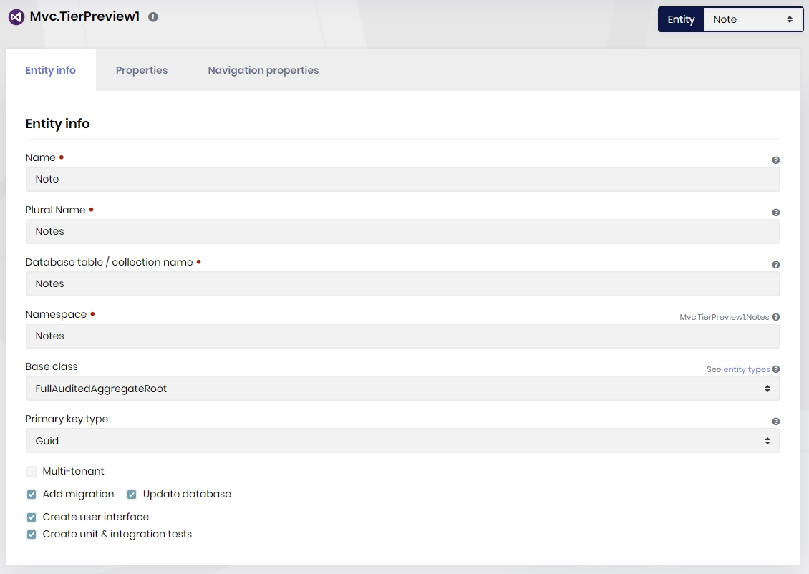
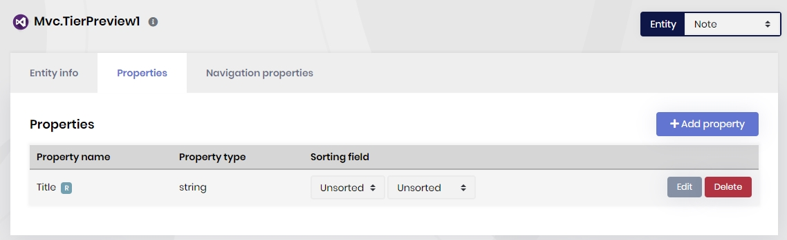
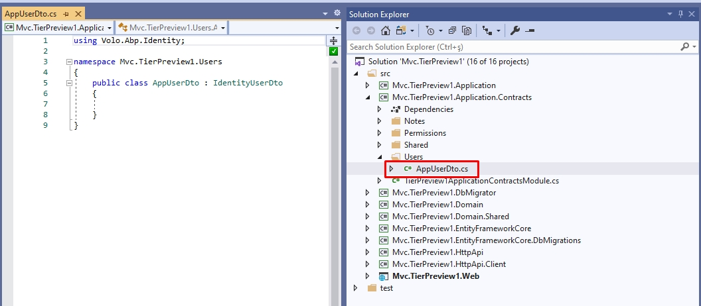
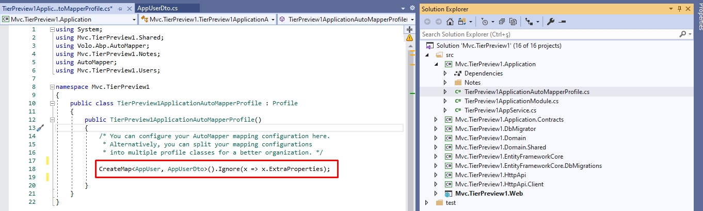
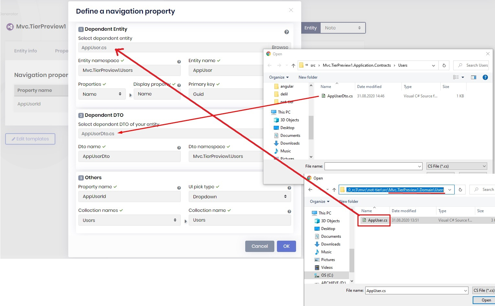
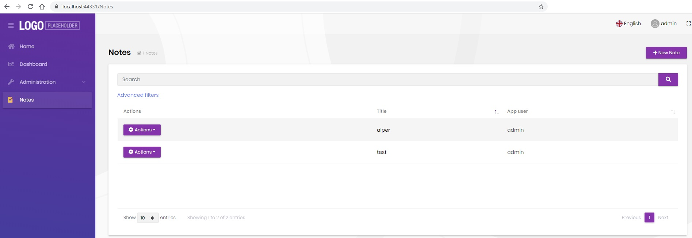
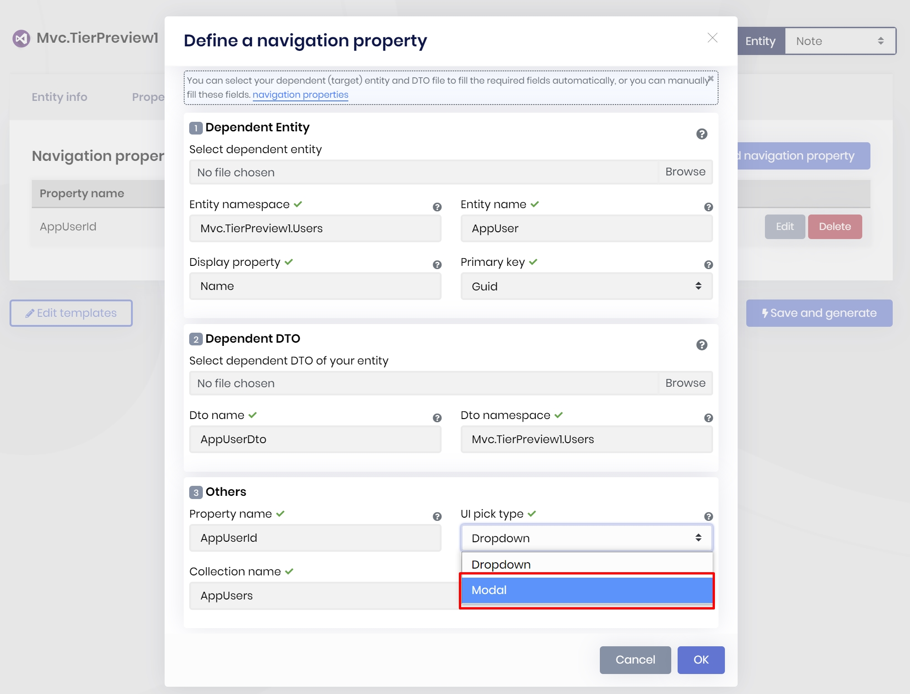
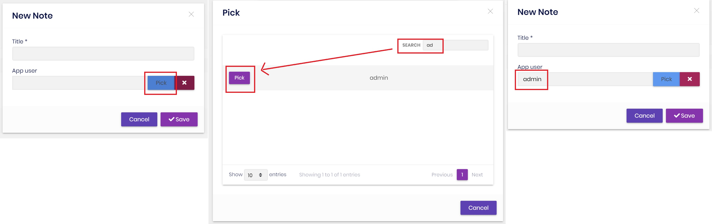

# JELLOG Suite: How to Add the User Entity as a Navigation Property of Another Entity

## Introduction

[JELLOG Suite](https://commercial.jellog.io/tools/suite), a part of the [JELLOG Commercial](https://commercial.jellog.io/), is a productivity tool developed by the team behind the JELLOG Framework. The main functionality of the JELLOG Suite is to generate code for you.

In this post, I'll show you how to add the user entity as a navigation property in your new entity, by the help of the JELLOG Suite.

> In the sample project MVC UI is used, but the same steps are applicable to the Angular UI as well.

## Code Generation

### Create a New Entity

Open the JELLOG Suite ([see how](https://docs.jellog.io/en/commercial/latest/jellog-suite/index)). Create a new entity called `Note`, as an example entity.



Then add a string property called `Title`, as an example property.



### Create AppUserDto

_Note that, creating `AppUserDto` is not necessary after JELLOG v4.X_

JELLOG Suite needs a DTO for the target entity (user, in this case) in order to define a navigation property.

To do this, create a new folder called "Users" in `*.Application.Contracts` then add a new class called `AppUserDto` inherited from `IdentityUserDto`.



We should define the [object mapping](https://docs.jellog.io/en/jellog/latest/Object-To-Object-Mapping) to be able to convert the `AppUser` objects to `AppUserDto` objects. To do this, open `YourProjectApplicationAutoMapperProfile.cs` and add the below line:

```csharp
CreateMap<AppUser, AppUserDto>().Ignore(x => x.ExtraProperties);
```



> Creating such a DTO class may not be needed for another entity than the `AppUser`, since it will probably be already available, especially if you had created the other entity using the JELLOG Suite.

### Define the Navigation Property

Get back to JELLOG Suite, open the **Navigation Properties** tab of the JELLOG Suite, click the **Add Navigation Property** button. Browse `AppUser.cs` in `*.Domain\Users` folder. Then choose the `Name` item as display property. Browse `AppUserDto.cs` in `*.Contracts\Users` folder. Choose `Users` from Collection Names dropdown.



### Generate the Code!

That's it! Click **Save and generate** button to create your page. You'll see the following page if everything goes well.



This is the new page that has been created by the JELLOG Suite. It can perform the fundamental CRUD operations. Also, it has the "App user" column that shows the related user name (you can easily change the automatically created "App user" title from the **Entity Name** field of the navigation property creation screen).

**Picking Users from Look Up Table**

We used dropdown element to select a user from the user list. If you have a lot of users, then it's good to pick a user from a look up table. A look up table is a modal window that lets you filter data and pick one. To do this, get back to Suite and click **Edit** button of user navigation which is set as `AppUserId` name. Choose "Modal" from the "UI Pick Type" field. Then click **Save and generate** button to recreate your page.



After successful code generation, you'll see the the user can be picked from user table.



## About the JELLOG Commercial RC

This example has been implemented with **JELLOG Commercial 3.1.0**. If you have not installed the JELLOG CLI and JELLOG Suite, follow the next steps:

1- Uninstall the current version of the CLI and install:

```bash
dotnet tool install --global DataGap.Jellog.Cli --version 3.1.0
```

2- Uninstall the current version of the Suite and install:

```bash
dotnet tool uninstall --global DataGap.Jellog.Suite && dotnet tool install -g DataGap.Jellog.Suite --version 3.1.0 --add-source https://nuget.jellog.io/<YOUR-API-KEY>/v3/index.json
```

Don't forget to replace the `<YOUR-API-KEY>` with your own key!
