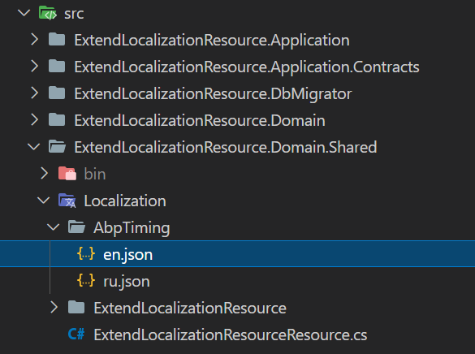
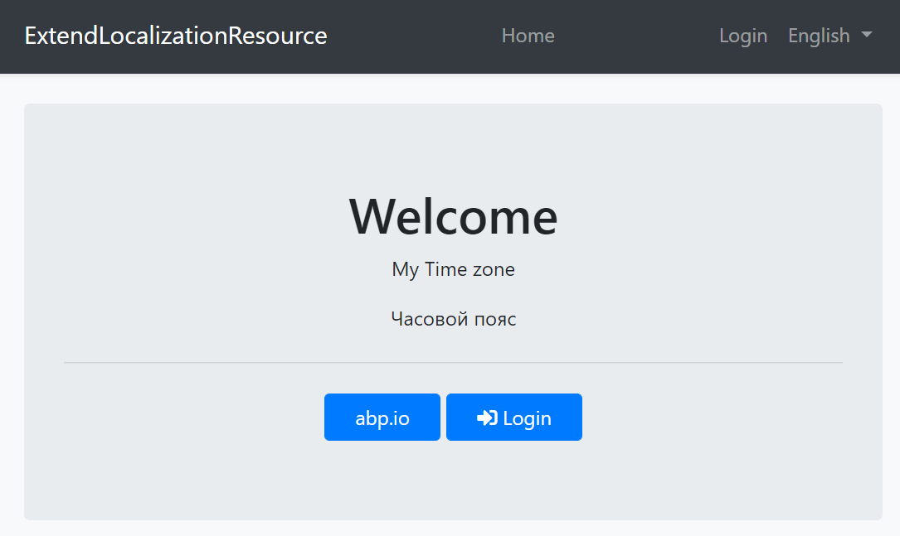

# How to override localization strings of depending modules

## Source Code

You can find the source of the example solution used in this article [here](https://github.com/jellogframework/jellog-samples/tree/master/DocumentationSamples/ExtendLocalizationResource).

## Getting Started

This example is based on the following document
https://docs.jellog.io/en/jellog/latest/Localization#extending-existing-resource

We will change the default `DisplayName:Jellog.Timing.Timezone` and `Description:Jellog.Timing.Timezone` of [`JellogTimingResource`](https://github.com/jellogframework/jellog/blob/dev/framework/src/DataGap.Jellog.Timing/DataGap/Jellog/Timing/Localization/JellogTimingResource.cs) and add localized text in [Russian language(`ru`)](https://github.com/jellogframework/jellog/blob/dev/framework/src/DataGap.Jellog.Timing/DataGap/Jellog/Timing/Localization/en.json).

I created the `JellogTiming` folder in the `Localization` directory of the `ExtendLocalizationResource.Domain.Shared` project.

Create `en.json` and `ru.json` in its directory.

`en.json`
```json
{
  "culture": "en",
  "texts": {
    "DisplayName:Jellog.Timing.Timezone": "My Time zone",
    "Description:Jellog.Timing.Timezone": "My Application time zone"
  }
}
```

`ru.json`
```json
{
  "culture": "ru",
  "texts": {
    "DisplayName:Jellog.Timing.Timezone": "Часовой пояс",
    "Description:Jellog.Timing.Timezone": "Часовой пояс приложения"
  }
}
```



We have below content in `ExtendLocalizationResource.Domain.Shared.csproj` file, See [Virtual-File-System](https://docs.jellog.io/en/jellog/latest/Virtual-File-System#working-with-the-embedded-files) understand how it works.

```xml
<ItemGroup>
    <EmbeddedResource Include="Localization\ExtendLocalizationResource\*.json" />
    <Content Remove="Localization\ExtendLocalizationResource\*.json" />
</ItemGroup>

<ItemGroup>
    <PackageReference Include="Microsoft.Extensions.FileProviders.Embedded" Version="5.0.*" />
</ItemGroup>
```

Change the code of the `ConfigureServices` method in `ExtendLocalizationResourceDomainSharedModule`.

```cs
Configure<JellogLocalizationOptions>(options =>
{
    options.Resources
        .Add<ExtendLocalizationResourceResource>("en")
        .AddBaseTypes(typeof(JellogValidationResource))
        .AddVirtualJson("/Localization/ExtendLocalizationResource");

    //add following code
    options.Resources
        .Get<JellogTimingResource>()
        .AddVirtualJson("/Localization/JellogTiming");

    options.DefaultResourceType = typeof(ExtendLocalizationResourceResource);
});
```

Execute `ExtendLocalizationResource.DbMigrator` to migrate the database and run `ExtendLocalizationResource.Web`.

We have changed the English localization text and added Russian localization.

### Index page

```cs
<p>@JellogTimingResource["DisplayName:Jellog.Timing.Timezone"]</p>
@using(CultureHelper.Use("ru"))
{
    <p>@JellogTimingResource["DisplayName:Jellog.Timing.Timezone"]</p>
}
```

