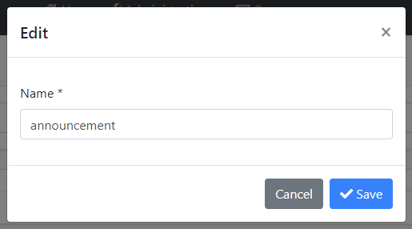

# Tag Management

CMS kit provides a **tag** system to tag any kind of resources, like a blog post.

## Options

The tag system provides a mechanism to group tags by entity types. For example, if you want to use the tag system for blog posts and products, you need to define two entity types named `BlogPosts` and `Product` and add tags under these entity types.

`CmsKitTagOptions` can be configured in the domain layer, in the `ConfigureServices` method of your [module](https://docs.jellog.io/en/jellog/latest/Module-Development-Basics) class.

**Example: Adding tagging support for products**

```csharp
Configure<CmsKitTagOptions>(options =>
{
    options.EntityTypes.Add(new TagEntityTypeDefiniton("Product"));
});
```

> If you're using the blog feature, the JELLOG framework defines an entity type for the blog feature automatically.

`CmsKitTagOptions` properties:

- `EntityTypes`: List of defined entity types(`TagEntityTypeDefiniton`) in the tag system. 

`TagEntityTypeDefiniton` properties:

- `EntityType`: Name of the entity type.
- `DisplayName`: Display name of the entity type. You can use a user friendly display name to show entity type definition on the admin website.
- `CreatePolicies`: List of policy/permission names allowing users to create tags under the entity type.
- `UpdatePolicies`: List of policy/permission names allowing users to update tags under the entity type.
- `DeletePolicies`: List of policy/permission names allowing users to delete tags under the entity type.

## The Tag Widget

The tag system provides a tag [widget](../../UI/AspNetCore/Widgets.md) to display associated tags of a resource that was configured for tagging. You can simply place the widget on a page like below:

```csharp
@await Component.InvokeAsync(typeof(TagViewComponent), new
{
  entityType = "Product",
  entityId = "..."
})
```

`entityType` was explained in the previous section. `entityId` should be the unique id of the product, in this example. If you have a Product entity, you can use its Id here.

## User Interface

### Menu Items

The following menu items are added by the tagging feature to the admin application:

* **Tags**: Opens the tag management page.

### Pages

#### Tag Management

This page can be used to create, edit and delete tags for the entity types.


You can create or edit an existing tag on this page.



## Internals

### Domain Layer

#### Aggregates

This module follows the [Entity Best Practices & Conventions](https://docs.jellog.io/en/jellog/latest/Best-Practices/Entities) guide.

##### Tag

A tag represents a tag under the entity type.

- `Tag` (aggregate root): Represents a tag in the system.

##### EntityTag

An entity tag represents a connection between the tag and the tagged entity.

- `EntityTag`(entity): Represents a connection between the tag and the tagged entity.

#### Repositories

This module follows the [Repository Best Practices & Conventions](https://docs.jellog.io/en/jellog/latest/Best-Practices/Repositories) guide.

Following custom repositories are defined for this feature:

- `ITagRepository`
- `IEntityTagRepository`

#### Domain services

This module follows the [Domain Services Best Practices & Conventions](https://docs.jellog.io/en/jellog/latest/Best-Practices/Domain-Services) guide.

##### Tag Manager

`TagManager` is used to perform some operations for the `Tag` aggregate root.

##### Entity Tag Manager

`EntityTagManager` is used to perform some operations for the `EntityTag` entity.

### Application layer

#### Application services

- `TagAdminAppService` (implements `ITagAdminAppService`).
- `EntityTagAdminAppService` (implements `IEntityTagAdminAppService`).
- `TagAppService` (implements `ITagAppService`).

### Database providers

#### Common

##### Table / collection prefix & schema

All tables/collections use the `Cms` prefix by default. Set static properties on the `CmsKitDbProperties` class if you need to change the table prefix or set a schema name (if supported by your database provider).

##### Connection string

This module uses `CmsKit` for the connection string name. If you don't define a connection string with this name, it fallbacks to the `Default` connection string.

See the [connection strings](https://docs.jellog.io/en/jellog/latest/Connection-Strings) documentation for details.

#### Entity Framework Core

##### Tables

- CmsTags
- CmsEntityTags

#### MongoDB

##### Collections

- **CmsTags**
- **CmsEntityTags**
