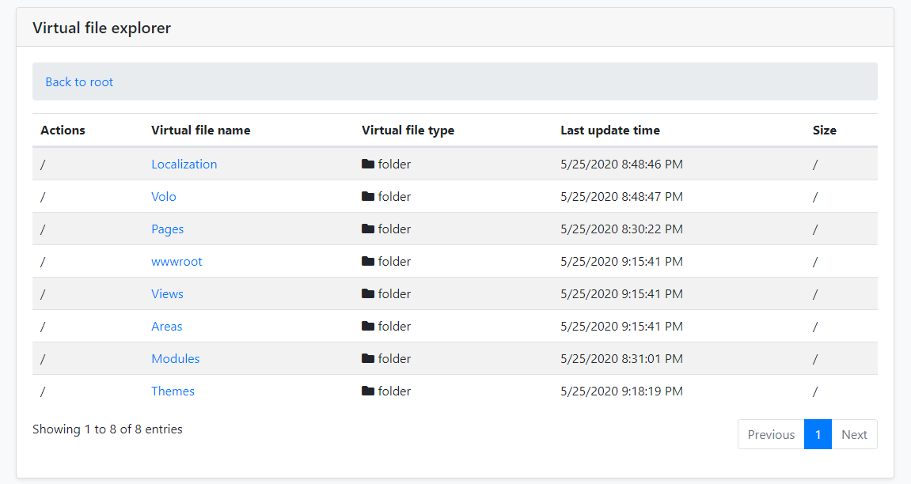

# Virtual File Explorer Module

## What is Virtual File Explorer Module?

Virtual File Explorer Module provided a simple UI to view all files in [virtual file system](../Virtual-File-System.md).

> Virtual File Explorer Module is not installed for [the startup templates](../Startup-Templates/Index.md). So, you need to manually add this module to your application.

### Installation

#### 1- Use JELLOG CLI

It is recommended to use the JELLOG CLI to install the module, open the CMD window in the solution file (`.sln`) directory, and run the following command:

`jellog add-module DataGap.VirtualFileExplorer`

#### 2- Manually install

Or you can also manually install nuget package to `Acme.MyProject.Web` project:

* Install [DataGap.Jellog.VirtualFileExplorer.Web](https://www.nuget.org/packages/DataGap.Jellog.VirtualFileExplorer.Web/) nuget package to `Acme.MyProject.Web` project.

  `Install-Package DataGap.Jellog.VirtualFileExplorer.Web`

##### 2.1- Adding Module Dependencies

  * Open `MyProjectWebModule.cs`and add `typeof(JellogVirtualFileExplorerWebModule)` as shown below;

  ```csharp
     [DependsOn(
          typeof(JellogVirtualFileExplorerWebModule),
          typeof(MyProjectApplicationModule),
          typeof(MyProjectEntityFrameworkCoreModule),
          typeof(JellogAutofacModule),
          typeof(JellogIdentityWebModule),
          typeof(JellogAccountWebModule),
          typeof(JellogAspNetCoreMvcUiBasicThemeModule)
      )]
      public class MyProjectWebModule : JellogModule
      {
          //...
      }
  ```

##### 2.2- Adding NPM Package

 * Open `package.json` and add `@jellog/virtual-file-explorer": "^2.9.0` as shown below:

  ```json
    {
        "version": "1.0.0",
        "name": "my-app",
        "private": true,
        "dependencies": {
            "@jellog/aspnetcore.mvc.ui.theme.basic": "^2.9.0",
            "@jellog/virtual-file-explorer": "^2.9.0"
        }
    }
  ```

  Then open the command line terminal in the `Acme.MyProject.Web` project folder and run the following command:

````bash
jellog install-libs
````

That's all,Now run the application and Navigate to `/VirtualFileExplorer`. You will see virtual file explorer page:



### Options

You can disabled virtual file explorer module via `JellogVirtualFileExplorerOptions` options:

```csharp
public override void PreConfigureServices(ServiceConfigurationContext context)
{
    PreConfigure<JellogVirtualFileExplorerOptions>(options =>
    {
        options.IsEnabled = false;
    });
}
```