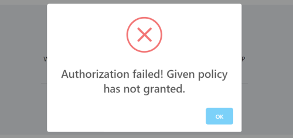

# ASP.NET Core MVC / Razor Pages UI JavaScript AJAX API

`jellog.ajax` API provides a convenient way of performing AJAX calls to the server. It internally uses JQuery's `$.ajax`, but automates some common tasks for you;

* Automatically **handles & localize the errors** and informs the user (using the [jellog.message](Message.md)). So you typically don't care about errors.
* Automatically adds **anti forgery** token to the HTTP header to satisfy CSRF protection validation on the server side.
* Automatically sets **default options** and allows to configure the defaults in a single place.
* Can **block** a UI part (or the full page) during the AJAX operation.
* Allows to fully customize any AJAX call, by using the standard `$.ajax` **options**.

> While `jellog.ajax` makes the AJAX call pretty easier, you typically will use the [Dynamic JavaScript Client Proxy](../Dynamic-JavaScript-Proxies.md) system to perform calls to your server side HTTP APIs. `jellog.ajax` can be used when you need to perform low level AJAX operations.

## Basic Usage

`jellog.ajax` accepts an options object that is accepted by the standard [$.ajax](https://api.jquery.com/jquery.ajax/#jQuery-ajax-settings). All the standard options are valid. It returns a [promise](https://api.jquery.com/category/deferred-object/) as the return value.

**Example: Get the list of users**

````js
jellog.ajax({
  type: 'GET',
  url: '/api/identity/users'
}).then(function(result){
  console.log(result);
});
````

This command logs the list of users to the console, if you've **logged in** to the application and have [permission](../../../Authorization.md) for the user management page of the [Identity Module](../../../Modules/Identity.md).

## Error Handling

The example AJAX call above shows an **error message** if you haven't login to the application or you don't have the necessary permissions to perform this request:



All kinds of errors are automatically handled by `jellog.ajax`, unless you want to disable it.

### Standard Error Response

`jellog.ajax` is compatible with the [exception handling system](../../../Exception-Handling.md) of the JELLOG Framework and it properly handles the standard error format returned from the server. A typical error message is a JSON as like below:

````json
{
  "error": {
    "code": "App:010042",
    "message": "This topic is locked and can not add a new message",
    "details": "A more detailed info about the error..."
  }
}
````

The error message is directly shown to the user, using the `message` and `details` properties.

### Non-Standard Error Response & HTTP Status Codes

It also handles errors even if the standard error format was not sent by the server. This can be case if you bypass the JELLOG exception handling system and manually build the HTTP response on the server. In that case, **HTTP status codes** are considered.

The following HTTP Status Codes are pre-defined;

* **401**: Shows an error message like "*You should be authenticated (sign in) in order to perform this operation*". When the users click the OK button, they are redirected to the home page of the application to make them login again.
* **403**: Shows an error message like "*You are not allowed to perform this operation*".
* **404**: Shows an error message like "*The resource requested could not found on the server*".
* **Others**: Shows a generic error message like "*An error has occurred. Error detail not sent by server*".

All these messages are localized based on the current user's language.

### Manually Handling the Errors

Since `jellog.ajax` returns a promise, you can always chain a `.cactch(...)` call to register a callback that is executed if the AJAX request fails.

**Example: Show an alert if the AJAX request fails**

````js
jellog.ajax({
  type: 'GET',
  url: '/api/identity/users'
}).then(function(result){
  console.log(result);
}).catch(function(){
  alert("request failed :(");
});
````

While your callback is fired, JELLOG still handles the error itself. If you want to disable automatic error handling, pass `jellogHandleError: false` the the `jellog.ajax` options.

**Example: Disable the auto error handling**

````js
jellog.ajax({
  type: 'GET',
  url: '/api/identity/users',
  jellogHandleError: false //DISABLE AUTO ERROR HANDLING
}).then(function(result){
  console.log(result);
}).catch(function(){
  alert("request failed :(");
});
````

If you set `jellogHandleError: false` and don't catch the error yourself, then the error will be hidden and the request silently fails. `jellog.ajax` still logs the error to the browser console (see the *Configuration* section to override it).

## Configuration

`jellog.ajax` has a **global configuration** that you can customize based on your requirements.

### Default AJAX Options

`jellog.ajax.defaultOpts` object is used to configure default options used while performing an AJAX call, unless you override them. Default value of this object is shown below: 

````js
{
    dataType: 'json',
    type: 'POST',
    contentType: 'application/json',
    headers: {
        'X-Requested-With': 'XMLHttpRequest'
    }
}
````

So, if you want to change the default request type, you can do it as shown below:

````js
jellog.ajax.defaultOpts.type = 'GET';
````

Write this code before all of your JavaScript code. You typically want to place such a configuration into a separate JavaScript file and add it to the layout using the global [bundle](../Bundling-Minification.md).

### Log/Show Errors

The following functions can be overridden to customize the logging and showing the error messages:

* `jellog.ajax.logError` function logs errors using the [jellog.log.error(...)](Logging.md) by default.
* `jellog.ajax.showError` function shows the error message using the [jellog.message.error(...)](Message.md) by default.
* `jellog.ajax.handleErrorStatusCode` handles different HTTP status codes and shows different messages based on the code.
* `jellog.ajax.handleJellogErrorResponse` handles the errors sent with the standard JELLOG error format.
* `jellog.ajax.handleNonJellogErrorResponse` handles the non-standard error responses.
* `jellog.ajax.handleUnAuthorizedRequest` handles responses with `401` status code and redirect users to the home page of the application.

**Example: Override the `logError` function**

````js
jellog.ajax.logError = function(error) {
    //...
}
````

### Other Options

* `jellog.ajax.ajaxSendHandler` function is used to intercept the AJAX requests and add antiforgery token to the HTTP header. Note that this works for all AJAX requests, even if you don't use the `jellog.ajax`.