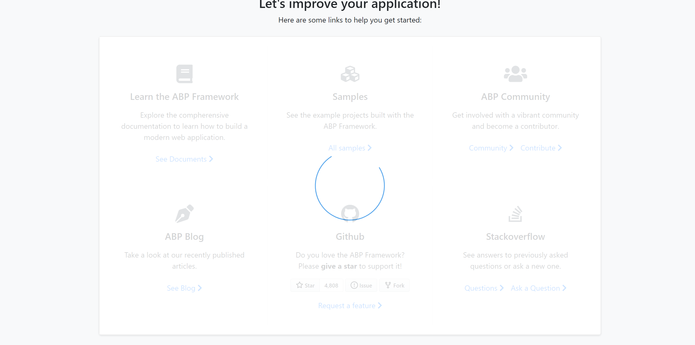

# ASP.NET Core MVC / Razor Pages UI: JavaScript UI Block/Busy API

UI Block API disables (blocks) the page or a part of the page.

## Basic Usage

**Example: Block (disable) the complete page**

````js
jellog.ui.block();
````

**Example: Block (disable) an HTML element**

````js
jellog.ui.block('#MyContainer');
````

**Example: Enables the previously blocked element or page:**

````js
jellog.ui.unblock();
````

## Options

`jellog.ui.block()` method can get an options object which may contain the following fields:

* `elm`: An optional selector to find the element to be blocked (e.g. `#MyContainerId`). If not provided, the entire page is blocked. The selector can also be directly passed to the `block()` method as shown above.
* `busy`: Set to `true` to show a progress indicator on the blocked area.
* `promise`: A promise object with `always` or `finally` callbacks. This can be helpful if you want to automatically unblock the blocked area when a deferred operation completes.

**Example: Block an element with busy indicator**

````js
jellog.ui.block({
  elm: '#MySection',
  busy: true
});
````

The resulting UI will look like below:



## setBusy

`jellog.ui.setBusy(...)` and `jellog.ui.clearBusy()` are shortcut functions if you want to use the block with `busy` option.

**Example: Block with busy**

````js
jellog.ui.setBusy('#MySection');
````

Then you can use `jellog.ui.clearBusy();` to re-enable the busy area/page.