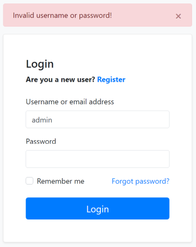

# ASP.NET Core MVC / Razor Pages: Page Alerts

It is common to show error, warning or information alerts to inform the user. An example *Service Interruption* alert is shown below:


## Basic Usage

If you directly or indirectly inherit from `JellogPageModel`, you can use the `Alerts` property to add alerts to be rendered after the request completes.

**Example: Show a Warning alert**

```csharp
namespace MyProject.Web.Pages
{
    public class IndexModel : MyProjectPageModel //or inherit from JellogPageModel
    {
        public void OnGet()
        {
            Alerts.Warning(
                text: "We will have a service interruption between 02:00 AM and 04:00 AM at October 23, 2023!",
                title: "Service Interruption"
            );
        }
    }
}
```

This usage renders an alert that was shown above. If you need to localize the messages, you can always use the standard [localization](../../Localization.md) system.

### Exceptions / Invalid Model States

It is typical to show alerts when you manually handle exceptions (with try/catch statements) or want to handle `!ModelState.IsValid` case and warn the user. For example, the Account Module shows a warning if user enters an incorrect username or password:



> Note that you generally don't need to manually handle exceptions since JELLOG Framework provides an automatic [exception handling](../../Exception-Handling.md) system.

### Alert Types

`Warning` is used to show a warning alert. Other common methods are `Info`, `Danger` and `Success`.

Beside the standard methods, you can use the `Alerts.Add` method by passing an `AlertType` `enum` with one of these values: `Default`, `Primary`, `Secondary`, `Success`, `Danger`, `Warning`, `Info`, `Light`, `Dark`.

### Dismissible

All alert methods gets an optional `dismissible` parameter. Default value is `true` which makes the alert box dismissible. Set it to `false` to create a sticky alert box.

## IAlertManager

If you need to add alert messages from another part of your code, you can inject the `IAlertManager` service and use its `Alerts` list.

**Example: Inject the `IAlertManager`** 

```csharp
using DataGap.Jellog.AspNetCore.Mvc.UI.Alerts;
using DataGap.Jellog.DependencyInjection;

namespace MyProject.Web.Pages
{
    public class MyService : ITransientDependency
    {
        private readonly IAlertManager _alertManager;

        public MyService(IAlertManager alertManager)
        {
            _alertManager = alertManager;
        }

        public void Test()
        {
            _alertManager.Alerts.Add(AlertType.Danger, "Test message!");
        }
    }
}
```

## Notes

### AJAX Requests

Page Alert system was designed to be used in a regular full page request. It is not for AJAX/partial requests. The alerts are rendered in the page layout, so a full page refresh is needed.

For AJAX requests, it is more proper to throw exceptions (e.g. `UserFriendlyException`). See the [exception handling](../../Exception-Handling.md) document.