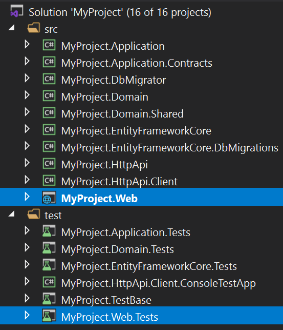

# ASP.NET Core MVC / Razor Pages: Testing

> You can follow the [ASP.NET Core Integration Tests documentation](https://docs.microsoft.com/en-us/aspnet/core/test/integration-tests) to learn details of ASP.NET Core integration tests. This document explains the additional test infrastructure provided by the JELLOG Framework.

## The Application Startup Template

The Application Startup Template contains the `.Web` project that contains UI views/pages/components of the application and a `.Web.Tests` project to test these.



## Testing the Razor Pages

Assume that you've created a Razor Page, named `Issues.cshtml` with the following contents;

**Issues.cshtml.cs**

````csharp
using System.Collections.Generic;
using System.Threading.Tasks;
using Microsoft.AspNetCore.Mvc.RazorPages;
using MyProject.Issues;

namespace MyProject.Web.Pages
{
    public class IssuesModel : PageModel
    {
        public List<IssueDto> Issues { get; set; }

        private readonly IIssueAppService _issueAppService;

        public IssuesModel(IIssueAppService issueAppService)
        {
            _issueAppService = issueAppService;
        }

        public async Task OnGetAsync()
        {
            Issues = await _issueAppService.GetListAsync();
        }
    }
}
````

**Issues.cshtml**

````html
@page
@model MyProject.Web.Pages.IssuesModel
<h2>Issue List</h2>
<table id="IssueTable" class="table">
    <thead>
        <tr>
            <th>Issue</th>
            <th>Closed?</th>
        </tr>
    </thead>
    <tbody>
        @foreach (var issue in Model.Issues)
        {
            <tr>
                <td>@issue.Title</td>
                <td>
                    @if (issue.IsClosed)
                    {
                        <span>Closed</span>
                    }
                    else
                    {
                        <span>Open</span>
                    }
                </td>
            </tr>
        }
    </tbody>
</table>
````

This page simply creates a table with the issues:


You can write a test class inside the `.Web.Tests` project just like the example below:

````csharp
using System.Threading.Tasks;
using HtmlAgilityPack;
using Shouldly;
using Xunit;

namespace MyProject.Pages
{
    public class Issues_Tests : MyProjectWebTestBase
    {
        [Fact]
        public async Task Should_Get_Table_Of_Issues()
        {
            // Act

            var response = await GetResponseAsStringAsync("/Issues");

            //Assert

            var htmlDocument = new HtmlDocument();
            htmlDocument.LoadHtml(response);

            var tableElement = htmlDocument.GetElementbyId("IssueTable");
            tableElement.ShouldNotBeNull();

            var trNodes = tableElement.SelectNodes("//tbody/tr");
            trNodes.Count.ShouldBeGreaterThan(0);
        }
    }
}
````

`GetResponseAsStringAsync` is a shortcut method that comes from the base class that performs a HTTP GET request, checks if the resulting HTTP Status is `200` and returns the response as a `string`.

> You can use the base `Client` object (of type `HttpClient`) to perform any kind of request to the server and read the response yourself. `GetResponseAsStringAsync` is just a shortcut method.

This example uses the [HtmlAgilityPack](https://html-agility-pack.net/) library to parse the incoming HTML and test if it contains the issue table.

> This example assumes there are some initial issues in the database. See the *The Data Seed* section of the [Testing document](../../Testing.md) to learn how to seed test data, so your tests can assume some initial data available in the database.

## Testing the Controllers

Testing a controller is not different. Just perform a request to the server with a proper URL, get the response and make your assertions.

### View Result

If the controller returns a View, you can use a similar code to test the returned HTML. See the Razor Pages example above.

### Object Result

If the controller returns an object result, you can use the `GetResponseAsObjectAsync` base method. 

Assume that you've a controller as defined below:

````csharp
using System.Collections.Generic;
using System.Threading.Tasks;
using Microsoft.AspNetCore.Mvc;
using MyProject.Issues;
using DataGap.Jellog.AspNetCore.Mvc;

namespace MyProject.Web.Controllers
{
    [Route("api/issues")]
    public class IssueController : JellogController
    {
        private readonly IIssueAppService _issueAppService;

        public IssueController(IIssueAppService issueAppService)
        {
            _issueAppService = issueAppService;
        }

        [HttpGet]
        public async Task<List<IssueDto>> GetAsync()
        {
            return await _issueAppService.GetListAsync();
        }
    }
}
````

You can write a test code to execute the API and get the result:

````csharp
using System.Collections.Generic;
using System.Threading.Tasks;
using MyProject.Issues;
using Shouldly;
using Xunit;

namespace MyProject.Pages
{
    public class Issues_Tests : MyProjectWebTestBase
    {
        [Fact]
        public async Task Should_Get_Issues_From_Api()
        {
            var issues = await GetResponseAsObjectAsync<List<IssueDto>>("/api/issues");
            
            issues.ShouldNotBeNull();
            issues.Count.ShouldBeGreaterThan(0);
        }
    }
}
````

## Testing the JavaScript Code

JELLOG Framework doesn't provide any infrastructure to test your JavaScript code. You can use any test framework and tooling to test your JavaScript code.

## The Test Infrastructure

[DataGap.Jellog.AspNetCore.TestBase](https://www.nuget.org/packages/DataGap.Jellog.AspNetCore.TestBase) package provides the test infrastructure that is integrated to the JELLOG Framework and ASP.NET Core.

> DataGap.Jellog.AspNetCore.TestBase package is already installed in the `.Web.Tests` project.

This package provides the `JellogAspNetCoreIntegratedTestBase` as the fundamental base class to derive the test classes from. The `MyProjectWebTestBase` base class used above inherits from the `JellogAspNetCoreIntegratedTestBase`, so we indirectly inherited the `JellogAspNetCoreIntegratedTestBase`.

### Base Properties

The `JellogAspNetCoreIntegratedTestBase` provides the following base properties those are used in the tests:

* `Server`: A `TestServer` instance that hosts the web application in tests.
* `Client`: An `HttpClient` instance that is configured to perform requests to the test server.
* `ServiceProvider`: The service provider that you can resolve services in case of need.

### Base Methods

`JellogAspNetCoreIntegratedTestBase` provides the following methods that you can override if you need to customize the test server:

* `ConfigureServices` can be overridden to register/replace services only for the derived test class.
* `CreateHostBuilder` can be used to customize building the `IHostBuilder`.

See Also

* [Overall / Server Side Testing](../../Testing.md)